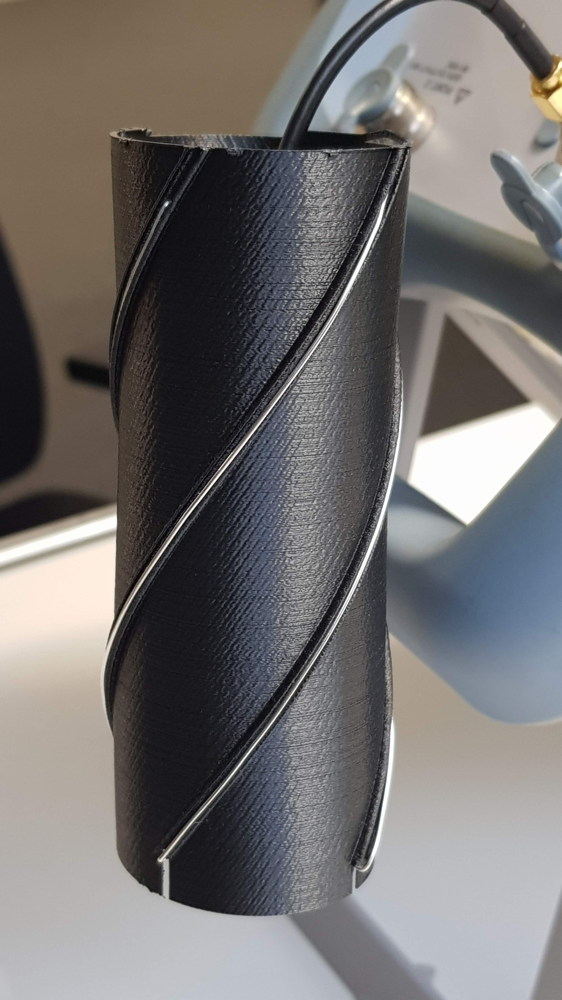
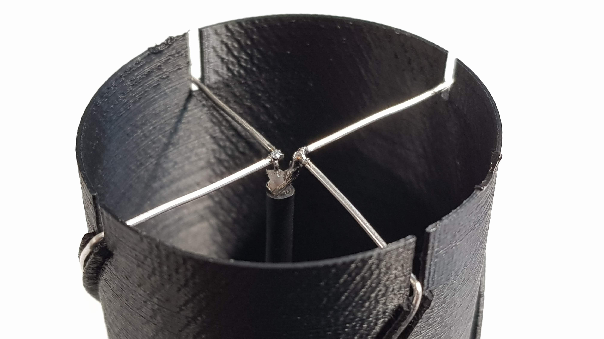
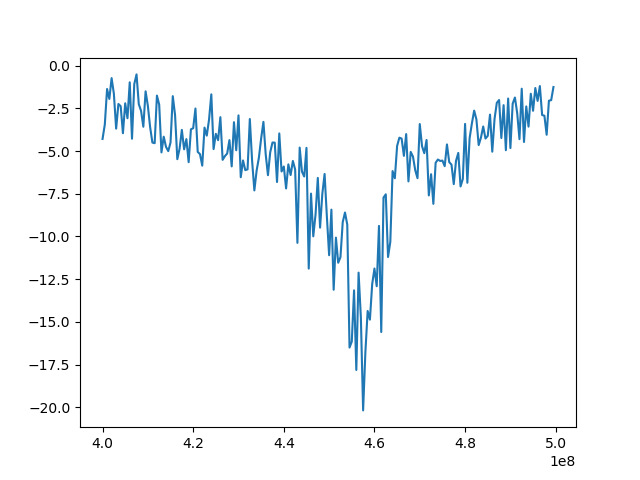
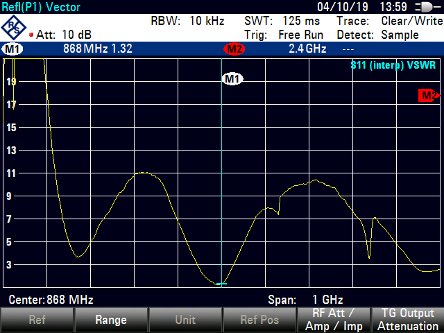

## Quadrifilar Helix Antenna for 868 MHz
Quadrifilar Helix Antenna is omnidirectional circularly polarized antenna. It's ability to receive or transmit a tight beam of
circularly polarized radiation while minimizing unwanted radiation perfect fits especially for satellite communication. This 3D model helps to achieve correct shape of antenna segments which has crucial effect for correct circular polarization.

Antenna is made from 2 pcs of 0.8mm silver plated copper wire, with total length 357 mm and 339.4 mm. 

Antenna feed-point

RG174 coaxial cable with SMA connector

For exact explanation of RF feed point connection refer to [this page](https://uuki.kapsi.fi/qha_simul.html).

#Antenna spectral characteristic

Calculated in:
http://jcoppens.com/ant/qfh/calc.en.php

<b>Warning. 3D model add parasitic capacity to antenna which moves resonant frequency. This was corrected by calculating antenna for higher frequeny (913 MHz). Changing any parameter must be verified by measurement.</b>

[Original 3D model](http://www.thingiverse.com/thing:634205)
